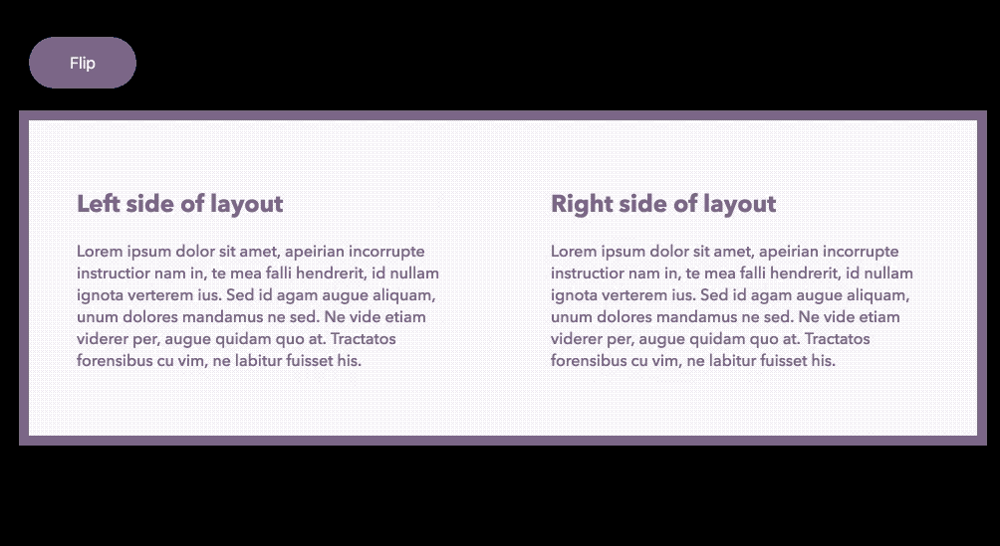

# Flipcard

Another React Flipcard, based on [@mzabriskie](https://github.com/mzabriskie)’s [react-flipcard](https://github.com/mzabriskie/react-flipcard), but with support for React v16, and some other considerations for the [Mort Modern](http://mort-modern.losttype.com/) type specimen site.

## Installation

```sh
npm install --save @kennethormandy/react-flipcard
```

## Example

```jsx
import React from 'react'
import { render } from 'react-dom'
import Flipcard from '@kennethormandy/react-flipcard'

// Import minimal required styles however you’d like
import '@kennethormandy/react-flipcard/dist/Flipcard.css'

class App extends React.Component {
  constructor() {
    super()

    this.state = {
      flipped: false,
    }
  }

  render() {
    return (
      <div>
        <button onClick={e => this.setState({ flipped: !this.state.flipped })}>
          Flip
        </button>
        <Flipcard flipped={this.state.flipped}>
          <h1>One</h1>
          <h1>Two</h1>
        </Flipcard>
      </div>
    )
  }
}

render(<App />, document.getElementById('target'))
```

### Transition Type

#### Horizontal

```jsx
<Flipcard type="horizontal">
  <h1>One</h1>
  <h1>Two</h1>
</Flipcard>
```

#### Revolving Door

```jsx
<Flipcard type="revolving-door">
  <h1>One</h1>
  <h1>Two</h1>
</Flipcard>
```

### Conditional two-column example



Like in the [Mort Modern](http://mort-modern.losttype.com/) type specimen site, it’s possible to change or disable the minimal Flipcard styles at certain breakpoints. This can be done entirely through CSS, but you might also want to use `matchMedia` to change some other part of your user interface (ex. disabling the button).

```jsx
<Flipcard>
  <Card>
    <div>
      <h2>Column 1</h2>
      <p>The main column on small viewports.</p>
    </div>
  </Card>
  <Card>
    <div>
      <h2>Column 2</h2>
      <p>Flip to see me on smaller viewports.</p>
    </div>
  </Card>
</Flipcard>
```

Within your CSS, you might do something like this:

```css
/* If the viewport is wide enough: */
@media (min-width: 750px) {

  /* Use the flipper as a Flexbox container: */
  .Flipcard-flipper {
    display: flex;
    transform: none !important;
  }

  /* Show both cards and remove the transitions: */
  .Flipcard-front, 
  .Flipcard-back {
    position: relative;
    transform: none !important;
    opacity: 1 !important;
  }
}
```

## Credits

* [react-flipcard](https://github.com/mzabriskie/react-flipcard) by [@mzabriskie](https://github.com/mzabriskie)
* [react-card-flip](https://github.com/AaronCCWong/react-card-flip) by [@AaronCCWong](https://github.com/AaronCCWong), for the revolving-door transition
* [Create a CSS Flipping Animation](https://davidwalsh.name/css-flip) by David Walsh

## License

[The MIT License (MIT)](LICENSE.md)

Copyright © 2017–2018 [Kenneth Ormandy Inc.](http://kennethormandy.com)
